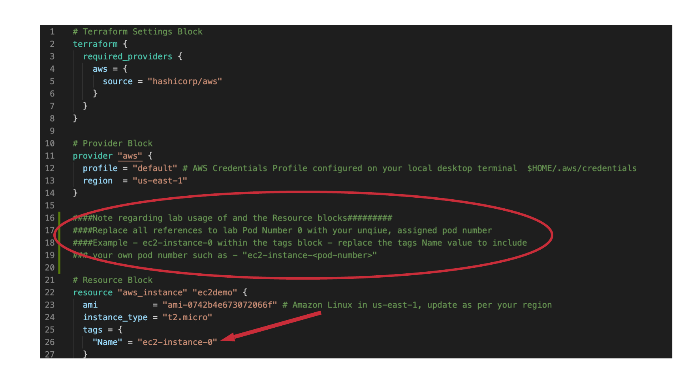
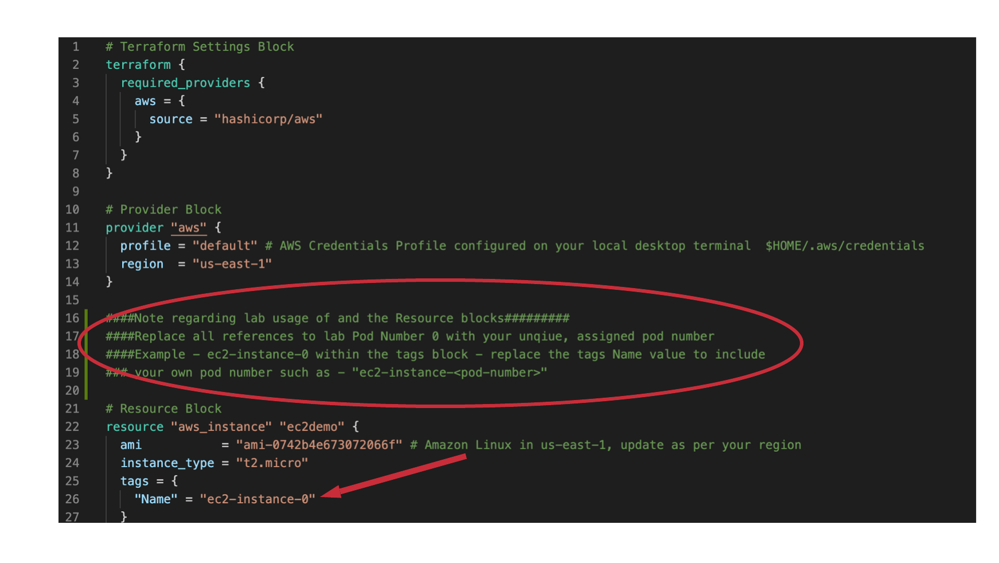
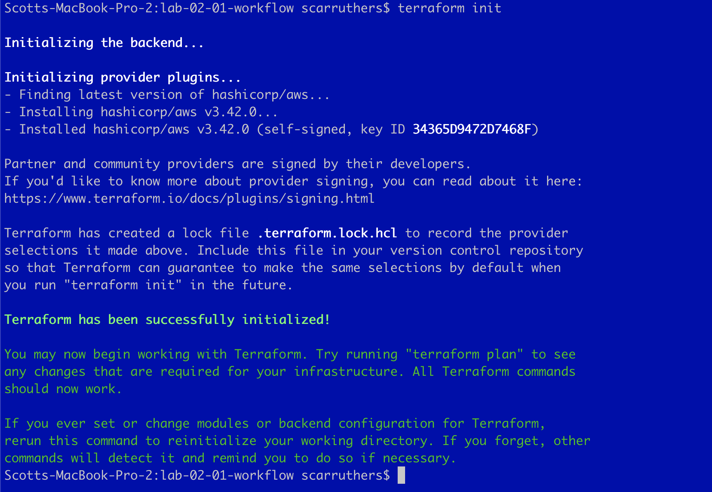
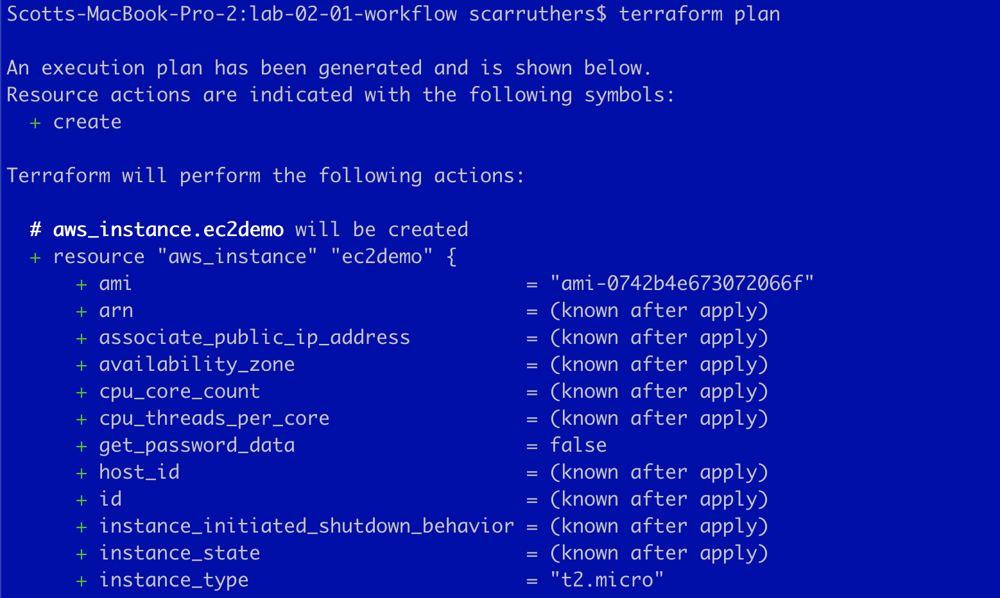
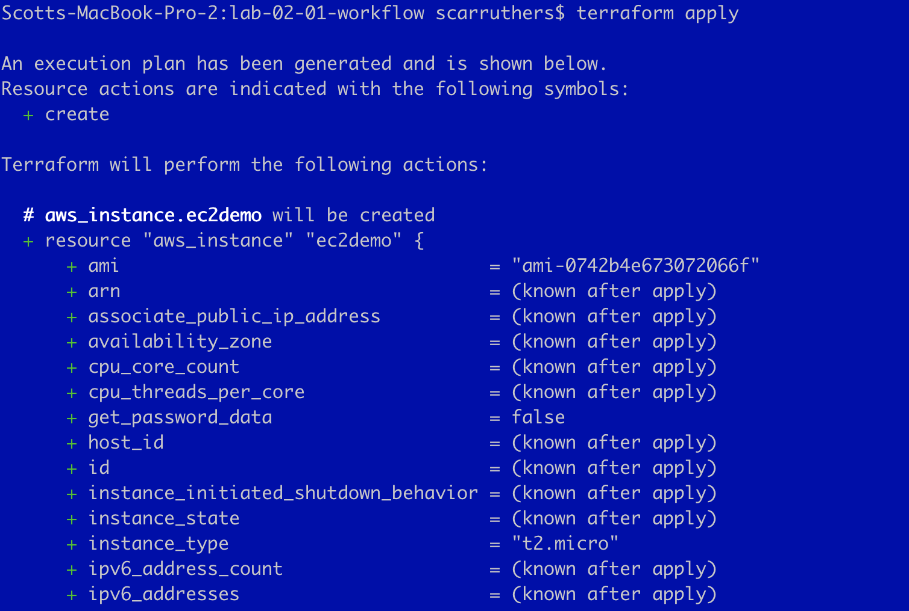
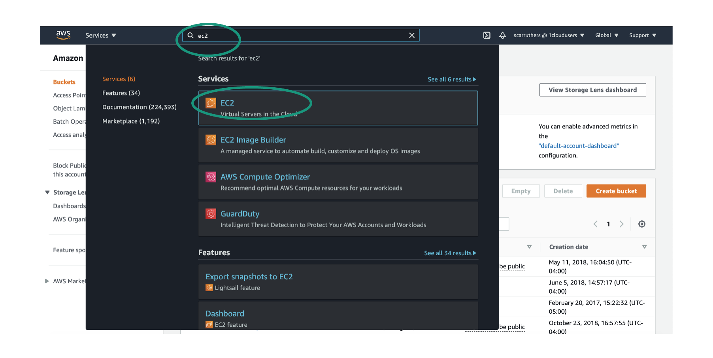
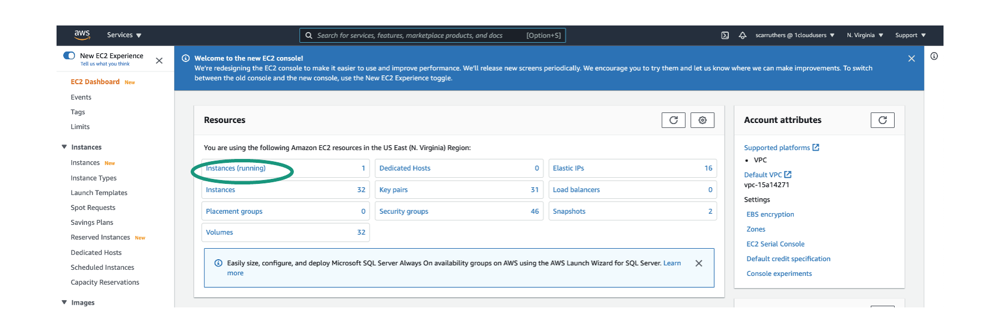
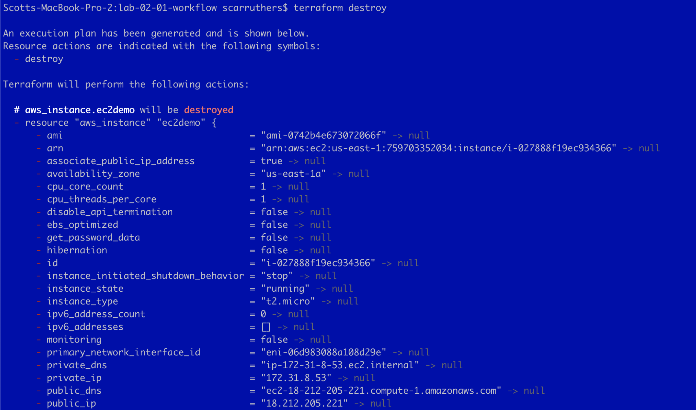
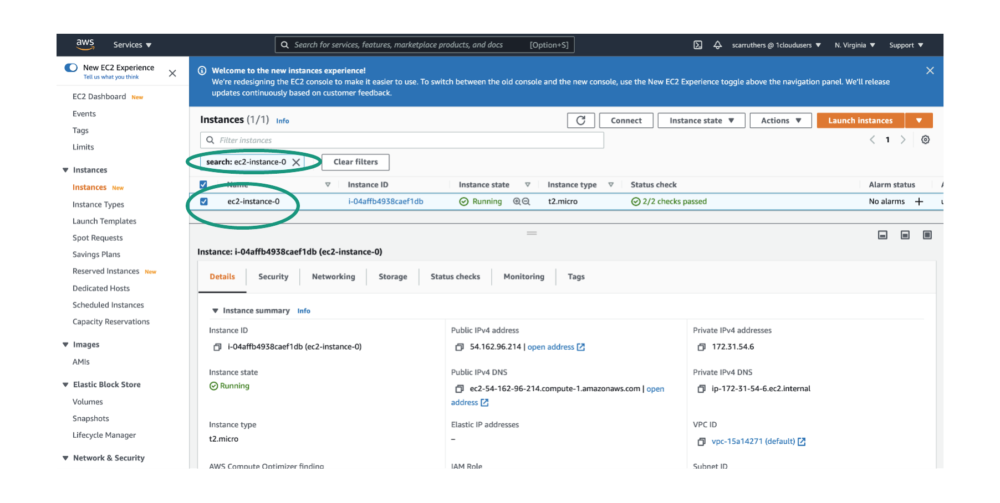
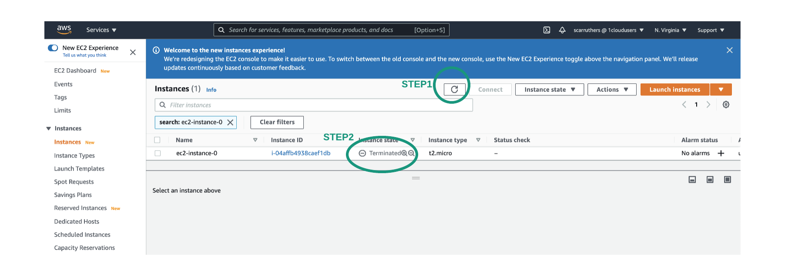

# Lab 0- **Setup**

## Log Into Your student Jumphost

**SSH JumpHosts: sre-jump.1cld.us**

**usernames:**

**s1**

**s2**

**s3**

**s4**

**through**

**s24**

**password: SRE-2023!**

## Configure Aws security:
```
*aws configure*
```


*Default region name [None]: us-east-1*

*Default output format [None]: json*
```
aws s3 ls
```
You should see a list of S3 buckets

Issue the following commands to clone the remote repo:

```
rm -rf SRE-TF/

git clone https://github.com/1CLD-US/SRE-TF
```
**Confirm access to AWS Console  
**● Validate access to lab AWS console instance by navigating to the following URL within a  
web browser  
● Suggested web browser for this course is Chrome  
https://1cloudusers.signin.aws.amazon.com/console  
● Proceed with authentication via user/pass= sre-student / SRE2023!

# Lab 1- **Terraform Basic Commands**

*Terraform Workflow Commands Overview*

-   Within this lab we will review the Terraform Basic Workflow commands
-   The Workflow commands - as we will explore in upcoming sections - consist of:
    -   terraform init
    -   terraform validate
    -   terraform plan
    -   terraform apply
    -   terraform destroy
-   Within this lab we will provide a walkthrough of the Terraform Basic Workflow commands for initial exposure and brief overview
-   Throughout the rest of the lab guide we will use these workflow sequences a countless number of iterations and become intimately familiar with the and it will soon become second nature to utilize this workflow to initiate Terraform manifests and associated resource creation
-   A walkthrough of the Terraform Basic Workflow additionally provides validation that our local working environment is properly configured to allow AWS resource creation via the Terraform CLI

| *Note Regarding Terraform Manifest Edits*  In a majority of our labs - beginning with our current lab - small modifications of the Terraform manifests will be required to provide unique naming of resources across all student pods and as such resources are created in the single AWS account utilized To bring your attention to the need and location of such edits the techniques shown below are utilized and include: Explicit instructions for the edit are included in each manifest such as the red circled highlight in this example Pointers to the necessary edit locations are provided via red arrow indicators such as the depicted example below Such manifest edits ensure ease of isolating student unique resources in per pod naming conventions and at times additionally prevent resource naming conflicts that would cause error conditions Other than these minor edits - our labs are designed to not require further manifest edits. Though authoring manifests - or additions to pre-existing manifests - may enhance the learning experience and throughout the class we will discuss opportunities/techniques to do such custom authoring for the students interested in doing so.   |
|-------------------------------------------------------------------------------------------------------------------------------------------------------------------------------------------------------------------------------------------------------------------------------------------------------------------------------------------------------------------------------------------------------------------------------------------------------------------------------------------------------------------------------------------------------------------------------------------------------------------------------------------------------------------------------------------------------------------------------------------------------------------------------------------------------------------------------------------------------------------------------------------------------------------------------------------------------------------------------------------------------------------------------------------------------------------------------------------------------------------------------------------------------------------------------------------------------------------------------------------------------------------------------------------------------------|

*GitHub Directory Code Location and Guidance*

-   The Github root directory for this lab and corresponding sub-directories are depicted below.
-   Use your own local copy of the repository for code execution and any code edits necessary.


## **Section-02: Terraform Init**

*Subdirectory for Lab Section*


*Change Directory into Section Sub-Directory Containing Terraform Manifest*
```
 cd SRE-TF/ 
 cd lab-02-basic-commands/section-02-01-workflow 
```
*Open the Current Manifest, Explore Contents, and Make Per Pod Edits*

| Open the following file in your use “nano” on jumphost (or your preferred editor) for this section:  nano ec2-instance.tf  Edit the code as necessary for your own Student Pod as instructed in the commented section of the manifest that begins with - “\#\#\#Note regarding lab usage”. Visual highlights are provided in the depictions below for further clarification of the location of necessary per pod edits. |
|-------------------------------------------------------------------------------------------------------------------------------------------------------------------------------------------------------------------------------------------------------------------------------------------------------------------------------------------------------------------------------------------------------------------------|

-   Our future labs will delve much deeper into the components of Terraform TF files (AKA Terraform manifests)
-   In this initial exploration simply take cursory note of some the following attributes of the manifest and much greater exploration will occur in subsequent labs
    -   Terraform block of manifest - defines our provider/integration points and in this case we are using the Hashicorp official AWS provider
    -   Provider block of manifest - defines arguments/attributes necessary to connect to the provider (AWS in this case). For AWS integration a profile which points to our AWS credentials and the AWS region for created resources are required fields.
    -   Resource block of manifest - definition of the intended resources desired for creation within AWS. In this example an EC2 compute instance/resource would be and we provide the two required fields for such a resource - the AMI (Amazon Machine Image) Operating System and the Instance Type which dictates the hardware profile (I.e. CPU, RAM, etc of the EC2 instance)
    -   
    -   



*Initiate the Terraform Provider*

| **Ancillary Lab Info**  Terraform documentation states the following regarding the usage of the “terraform init” command In addition to generally initializing the working directory the command downloads and provokes the provider integration stated in the manifest - in this case the “hashicorp/aws” provider which allows AWS integration and resource creation  **  |
|----------------------------------------------------------------------------------------------------------------------------------------------------------------------------------------------------------------------------------------------------------------------------------------------------------------------------------------------------------------------------------------------------------------------------|

-   From within the navigated to directory of the prior step \> execute the command “terraform init”
```
 terraform init 
 ```
|----------------|



| **Ancillary Lab Info**  Upon completion of the “terraform init” command \> a .terraform directory and a .terraform.lock.hcl file have been created as depicted below Note - this directory structure is listed below via MacOS Linux CLI commands. WIthin a Windows PowerShell session utilize only “ls” instead.     Within the .terraform directory exist a number of sub-directories and within this path a provider specification - allowing integration with AWS for resource creation - has been created and as depicted below   |
|------------------------------------------------------------------------------------------------------------------------------------------------------------------------------------------------------------------------------------------------------------------------------------------------------------------------------------------------------------------------------------------------------------------------------------------------------------------------------------------------------------------------------------------------------------------------------------------------------------------------------------------------------------------------------|

## **Section-03: Terraform Validate**

*Validate the Terraform Manifest*

-   Within the same directory utilized in the prior section (lab-02-basic-commands/section-02-01-workflow) - which is where our Terraform manifest for this lab exist and where “terraform init” has now initialized our provider - issue the “terraform validate” command
-   The validate command will ensure that there are no syntaxical issues with our manifest
-   As depicted below - we should receive validation that there are no problems with our manifest file
```
 terraform validate 
```
|--------------------|


## **Section-04: Terraform Plan**

*Create a Terraform Execution Plan*

-   Within the same directory (lab-02-basic-commands/section-02-01-workflow) issue the “terraform plan” command
-   The plan command creates a execution plan and displays to the console the action type (in this case create) and the resources/specifications that will be implemented
-   In our utilization of the plan command - the execution is being used to display to the terminal the resources that would be created when/if the Terraform manifest file were actually implemented. The plan command does not actually create any resources in AWS but rather displays the intended invokes.

```
terraform plan 
```
|----------------|

-   Output truncated to only display initial dialog of the plan execution



## **Section-05: Terraform Apply**

-   Within the same directory (lab-02-basic-commands/section-02-01-workflow) issue the “terraform apply” command
-   The apply command will provoke EC2 instance/Terraform resource creation within AWS
-   Reviewing the last couple of execution steps - the “terraform plan” command execution displays the intended resource creation and once we are comfortable with that intent the “terraform apply” command is executed to proceed with actual resource creation in the provider (AWS)
-   During command execution - the apply command will pause and prompt the user with a ““Do you want to perform these actions?”” prompt. Respond with a “yes” to this prompt.
-   Note that it may take 30-60 seconds for the resource creation to complete as depicted in the final screenshot below
```
terraform apply
```
|-----------------|




*Validate Creation of the EC2 Instance*

-   Return to the AWS console and type “EC2” from the top search bar and select the first search result (“EC2”) as depicted below



-   Enter the “Running (Instances)” path as depicted below



-   Isolate the EC2 instance created by the Terraform manifest. For ease in isolation of your pod resource \> type the Name assigned in the tags section of the manifest (I.e. ec-instance-\<pod-number\>) into the “Filter instances” box and press enter.
-   Check the box to the left of the instance to reveal greater details pertaining to the instance
-   With the instance selected we can prove that not only was the resource created by Terraform but additionally all specifications in the manifest were applied during creation
-   Steps for validations are depicted below


## **Section-06: Terraform Destroy**

-   Return to your terminal session \> within the same directory used prior (lab-02-basic-commands/section-02-01-workflow) issue the “terraform destroy” command to delete the manifest resources (EC2 resource in this case) from AWS
-   The execution of the destroy command will output the resource specifications intended for deletion to the terminal session
-   The user will be prompted with a confirmation to proceed \> respond “yes” to this prompt
-   Note that a delay of 30-60 seconds is expected during the destroy process as shown in the final depiction below

```
terraform destroy
```
|-------------------|




*Confirm the Destroy of the Resource in the AWS Console*

-   Return to the AWS Console
-   Assuming no navigation in the console was conducted outside of our lab steps \> our location would be within the EC2 Console based on prior steps and the previous search filter (“ec2-instance-\<pod-number\>”) would be in place as depicted below
-   Should this not be your current location within the AWS Console \> simply revisit the instructions in this lab section prior detailing the navigation to the EC2 console and isolating your pod EC2 instance



-   Press the Reset icon (Step 1 below)
-   Following page refresh \> confirm the EC2 Instance State is “Terminated”
-   The resource state of Terminated confirms that the “terraform destroy” command properly decommissioned the resource
-   Eventually such terminated devices will disappear completely from the AWS Console



| *Terraform State File Deletion*  Following the Destroy of Terraform Destroy execution the local directory will appear as follows:    We will explore further the files that are resident in this directory in later labs. But note that the Destroy sequence did not rid the directory of files automatically created by the Terraform Init and Terraform Apply execution (I.e. the .terraform directory, the lock file, and the tfstate file) While it is not necessary for our lab use - consider removing these files should you desire a clean directory for your future use of the same labs And more importantly - should you desire to create your own GitHub repository with this source code - we definitely do not want these state and module files/directories uploaded as we desire clean execution when such repos are downloaded in the future Essentially - in this example - we only want to leave the actual Terraform manifest in the directory (ec2-instance.tf) if such considerations are a concern To rid the directory of all files/directories except for the Terraform manifest - execute the following commands We will not repeat such steps following subsequent lab Destroy exercises but consider using this step after each lab based on your needs/preferences For additional clarification on how a clean directory (only manifest) would appear - reference the class GitHub repositories |
|---------------------------------------------------------------------------------------------------------------------------------------------------------------------------------------------------------------------------------------------------------------------------------------------------------------------------------------------------------------------------------------------------------------------------------------------------------------------------------------------------------------------------------------------------------------------------------------------------------------------------------------------------------------------------------------------------------------------------------------------------------------------------------------------------------------------------------------------------------------------------------------------------------------------------------------------------------------------------------------------------------------------------------------------------------------------------------------------------------------------------------------------------------------------------------------------------------------------------------------------------------------------------------------------------------------------------------------------------------------------------------------------------------------------------------------------------------------------------------------------------------------------|

| rm -rf .terraform\* rm -rf terraform.tfstate\* |
|------------------------------------------------|

| Directory contents post state/module file removals:   |
|----------------------------------------------------------------------------------------------------------------------------------------------|
